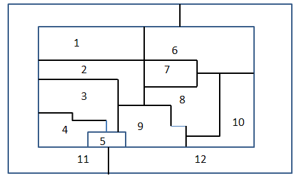
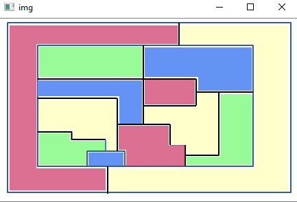

# Graph Coloring with Genteic Algorithm
4 colors graph coloring problem solved by genetic algorithm with the following parameters:
- population - number of initial solution option (N)
- mutation_probability- the probability to have a mutation on specific gen
- crossover_probability- the probability to have crossover between two genes
- num of vertex- how many nodes in the graph

Solving graph according to adjacency matrix as input. 
Coloring only specific map 

# How it works
On initizalization N optional solutions are generated by chosing random color for each node (calld population).
Every generation there is a use of genetic operators s.a:
- crossover
- mutations 
- repruduce
and the best solutions are chosen for next generation according to Fitness function:
```python
    #coloring- dictionary of vertex:color
    def self_fitness(self, coloring, this_color):
        fitness = 0
        for v, color in coloring.items():
            if v.ID in self.neighbours_index:
                if color == this_color:
                    fitness += 1
        return fitness
```
The solution is a valid coloring s.a:



# Requerments
 * cv2
 * numpy
